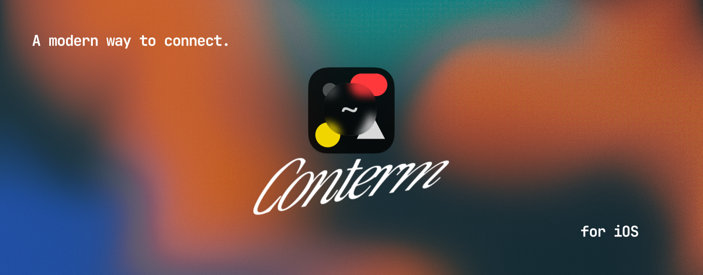

<p align="center">
  
</p>

<p align="center">
  <a href="https://github.com/mahdiarfrm/conterm-ios/blob/master/LICENSE"></a>
  <a href="https://github.com/mahdiarfrm/conterm-ios/stargazers"></a>
  
  
</p>

<p align="center">
  <a href="https://github.com/mahdiarfrm/conterm"><b>Conterm for macOS</b></a> ·
  <a href="#building-from-source">Build it</a> ·
  <a href="https://github.com/mahdiarfrm/conterm-ios/issues">Report a bug</a>
</p>

**Conterm for iOS** is an SSH client built on
[Ghostty's](https://github.com/ghostty-org/ghostty) terminal engine, in the
design language of [Conterm](https://github.com/mahdiarfrm/conterm). Real VT
emulation and GPU rendering on a phone, a briefing screen for any host you
connect to, a command center for AI coding agents running on your machines,
and widgets that put all of it on the Lock Screen.

It is not a port of the Mac app. Conterm's lane is *ambient awareness and
safety* — see it, feel prod, get told — and several of those ideas are better
on a phone than on a desktop, because "did the 3am job run?" and "is that box
OK?" are questions you ask while away from the machine.

> Conterm is an independent frontend built on **libghostty**, with local
> patches that make a pty-less terminal possible on iOS at all. It is not
> affiliated with, endorsed by, or sponsored by the Ghostty project. The
> terminal engine — parsing, scrollback, selection, search, fonts and GPU
> rendering — is Ghostty's, MIT-licensed. Full third-party notices are in
> [NOTICE.md](NOTICE.md).

## Contents

- [Features](#features)
- [Requirements](#requirements)
- [Building from source](#building-from-source)
- [Testing](#testing)
- [How it fits together](#how-it-fits-together)
- [Layout](#layout)
- [Design](#design)
- [License](#license)

## Features

### Terminal

- **Ghostty's engine, not a reimplementation** — VT parsing, scrollback,
  selection, wide glyphs and ligatures, and Metal rendering all come from
  libghostty. `vi`, `htop`, `tmux` and anything else full-screen work because
  the emulator is the real one.
- **Sessions outlive their screen** — a terminal is a process you leave
  running, not a page you visit. Navigating back keeps the shell; a stray back
  swipe will not kill a `tail -f`. Several shells per host, each with its own
  verb, so tapping a host always resumes rather than silently dialling again.
- **An accessory row sized for a phone** — `ctrl` and `alt` latch visibly,
  `esc`, `tab`, all four arrows and the punctuation a shell needs fit a 402pt
  screen at once, and a pinned key puts the keyboard away, because half the
  screen back is worth a lot when you are reading a log. The keys are painted
  in the terminal's own bed colour so the strip disappears.
- **Find in scrollback** — the engine's own search, driven through the same
  keybind action the desktop uses, so it finds a line that scrolled off an
  hour ago rather than one that happens to still be on screen. Matches are
  highlighted by the renderer and stepping one scrolls it in.
- **Touch scrolling that tracks your finger** — one-to-one, with a decaying
  flick, at the panel's real refresh rate rather than capped at 60Hz.
- **Keystrokes are keystrokes** — every character goes through the key path
  with a real keycode, never the paste path, which replaces control bytes with
  spaces. That is the difference between `:q!` leaving vim and `:q!` being
  typed into your file.

### Hosts

- **Import your `~/.ssh/config`** — a real parser: `Include` is followed,
  globs are matched the way ssh matches them, and `Match` blocks are skipped
  rather than silently misapplied. A fleet arrives in one step instead of
  twelve forms.
- **Groups** — colour-coded, collapsible, ported from the Mac app's tab
  groups. Membership lives on the host and definitions live in their own file,
  so a group can be renamed or recoloured without rewriting a single host, and
  deleting one frees its hosts rather than taking them with it.
- **Keys are their own thing** — you have one `id_rsa` and twelve machines
  that accept it, so a host references a key by id and the material lives in
  the Keychain. Import from Files (iCloud Drive included); format and
  encryption are detected up front, so you are only asked for a passphrase
  when the key has one, and handing it an `id_rsa.pub` says so at import
  rather than as an auth failure days later.
- **Nearby** — Macs running Conterm advertise over Bonjour and appear above
  your saved hosts while the list is on screen. Tapping one opens the editor
  prefilled. A Mac with Remote Login off says so, and where to turn it on.
- **Quick Connect** — `user@host`, nothing saved.

### Host Overview

The answer to "is that box OK?", gathered in one key-authenticated SSH round
trip and led by a panel that always shows load, memory and disk in the same
three places, under a status gem that sums the machine.

Underneath: uptime and the full load triplet, every mount, network, containers
and VMs, Kubernetes workloads, failed units, the busiest processes, and recent
journal and kernel errors. A cached snapshot renders instantly while a fresh
probe runs behind it, and the screen says how old the numbers are rather than
presenting a stale reading as live. It leads somewhere too — an *Open a shell*
bar, so a briefing that finds a problem does not make you go back and find the
host again.

**Containers you can act on** — running containers across Docker, Podman,
containerd and Apple's `container`, in one list. Start is immediate; stop and
restart ask first, and the button names the act — *Restart web*, never
*Continue* — because a confirmation whose button says OK is one you tap rather
than read. A host whose name looks like production says so in the message.

### Agent Center

Conterm on macOS reads Claude Code's transcripts off local disk. Here they are
on the far end of an SSH connection and there are hundreds of megabytes of
them, so the work is split at the seam that makes both halves cheap: the
remote reads only the bytes appended since last time and emits one short line
per assistant message, and the phone keeps the offsets and does the
accumulation. `awk`, because it is the only thing guaranteed to exist on a box
that happens to run Claude Code.

A bounded tail read paints the roster in under a second; the usage pass fills
in cost, burn rate, tokens and model behind it. Sorted needs-you first,
because the only urgent question on a phone is whether anything is waiting.

**And you can answer.** Over SSH there is no pty to type into — unless the
agent runs under a multiplexer, which is how anyone leaves one running. The
collector lists tmux panes and encodes each one's working directory the way
Claude Code encodes a project directory, so the match is a string comparison
rather than a guess. Text and Return go as two separate `send-keys`, because a
trailing newline is pasted, not submitted.

### Your Mac, from the phone

The Mac app publishes its state to a file; the phone reads it over the SSH
connection it already has. No listening port on your laptop, no firewall
prompt, no authentication scheme invented from scratch, and it works from
anywhere you can reach the machine — including through a jump host.

- **Live, not polled** — one channel stays open on the pooled connection and a
  small loop on the Mac writes only when the state actually changes. Nothing
  crosses the network while nothing is happening; a change lands in about
  300ms. The loop's heartbeat is one byte every three seconds and its real job
  is dying: with the phone gone the write takes `SIGPIPE`, so leaving the
  screen cleans up after itself.
- **Windows, tabs, groups and panes** — each pane's working directory, which
  ones are SSH'd where, and what any agent in them is doing.
- **A closed set of five commands** — tap a pane to bring it forward, or reply
  to an agent that is waiting. Not arbitrary shell: the honest limit is not
  "don't act", it is "act only in ways the keyboard could". Commands travel
  base64-encoded and land via a temp file and a rename, so a reply containing
  a quote cannot become shell syntax on the other end and the Mac can never
  read half a file.
- **A snapshot that stopped updating says so**, with its age, rather than
  presenting dead tabs as live.

### Widgets, Lock Screen and Dynamic Island

Six faces on one design and one data contract, each answering one more
question than the last: inline whether anything is running, circular how many
and whether anything is wrong, rectangular which one and how long, small the
session you are in, medium the rest of the fleet, large what wants you.

New features reach the home screen by emitting a `Signal` — a small uniform
thing with a kind, a title and a weight — which every face with room already
knows how to draw, ranked. Agents waiting on your Mac arrive that way today.

The Dynamic Island carries a running session while you are in another app:
compact, a status gem and the host; expanded and on the Lock Screen, where it
is, what state it is in, how much has come back, and an elapsed timer the
system draws itself so it ticks without spending a refresh. Updates are
deliberately sparse — a terminal under `yes` would otherwise burn the Live
Activity budget in seconds and go stale exactly when something happened.

See [docs/WIDGETS.md](docs/WIDGETS.md) for the design system and how to add to
it.

### Command palette

On a Mac the palette is a shortcut; on a phone it is the primary way to get
anywhere, because every other navigation affordance costs screen. So it lives
in a persistent bar with touch-sized rows, and one query reaches your hosts,
their overviews, Quick Connect, ssh-config import, the key library, and a live
calculator — arithmetic, `0x`/`0b`/`0o` literals, re-basing and unit
conversions. Ranked by how often and how recently you use each thing.

### Snippets

The largest cost of a terminal on a phone is not the screen, it is the
keyboard: `docker compose logs -f --tail=100 web` is thirty-nine characters of
punctuation on a surface with no home row. Saved commands, one tap, scoped to
a host or kept everywhere. Typed rather than pasted and submitted with a real
Return, so a snippet behaves exactly like having typed it — and `submits` can
be off for one you want to finish by hand. They live on a key in the accessory
row, where the thumb already is.

### iPad

A real split view: the host list is a sidebar and the session lives beside it,
which is the whole reason to use a tablet for this — you can watch a build and
pick the next host without one replacing the other. The four destinations are
written once and attached to whichever column owns navigation, so the phone
and tablet layouts cannot drift into two copies of a screen.

### Settings

Seven things, each of which changes something you can point at: how wide a new
terminal aims to be — the font size follows from it and the screen — whether
the screen stays awake, sound effects, haptics, a separate typing haptic, the
launch animation, and one interface-size slider that scales the chrome around
the terminal and never the terminal itself.

Laid out as typographic bands rather than grouped boxes, because on a phone a
card inside a sheet inside a rounded window is three borders deep before any
content.

### Security

- **Host keys are verified.** Trust-on-first-use asks once, showing the
  fingerprint grouped in fours so it can be compared against `ssh-keyscan`. A
  changed key is refused outright, with no *continue anyway*: a rebuilt server
  and an attacker are indistinguishable from here, so forgetting a key lives
  in the host's editor, as something you go and do on purpose. Verification is
  opt-out rather than opt-in — the connection consults the trust store itself,
  so a call site cannot forget.
- **Background work can never raise the prompt.** Probes, Agent Center and the
  Mac reader are refused instead. A fingerprint dialog that appears without a
  gesture behind it is one people learn to tap through.
- **Private keys live in the Keychain**, referenced by id, never copied into a
  host record.

## Requirements

- **iOS / iPadOS 18** or later, iPhone and iPad.
- **Xcode 26** and its Command Line Tools, to build.
- An Apple Developer account for signing — the App Group the widget extension
  needs (`group.dev.conterm.ios`) has to be registered on the App ID, which
  only happens when Xcode can reach Apple.

There is no App Store build. This is source you compile and run on your own
device.

## Building from source

Both native dependencies build from source; neither is checked in.

```bash
git clone https://github.com/mahdiarfrm/conterm-ios.git
cd conterm-ios

bash scripts/build-ghostty.sh install   # clone pin, apply patches, zig build
bash scripts/build-libssh2.sh           # OpenSSL + libssh2, device and simulator
open Conterm.xcodeproj
```

`build-ghostty.sh` fetches the pinned Zig toolchain itself — pin constants
live in `scripts/ghostty-pin.sh` — and verifies that every slice actually
exports `_ghostty_surface_write_output`. A build where the patches silently
failed to apply otherwise shows up much later, as a terminal that stays black.

Running on a device also needs the iOS platform bundle, which Xcode 26 does
not install by default:

```bash
xcodebuild -downloadPlatform iOS
```

## Testing

The suite runs against a real SSH daemon rather than a mock, because the
transport spent most of its life having never met one.

```bash
bash scripts/test-host.sh    # throwaway sshd: own host key, client key, config
bash scripts/selftest.sh     # build, install, run the suite
```

`test-host.sh` stands up an sshd from nothing under `.test-host/`, running as
you and touching nothing outside it. `selftest.sh` builds, installs and runs
against it, on the simulator or on a connected iPhone — on device the key
travels in the environment, since the phone cannot read the Mac's filesystem.

What it covers: host-key refusal for an unknown and a changed key, connection
phases and latency, multiplexed commands, the pty matching the grid and
resizes reaching the far end, a 200KB flood arriving whole, full-screen apps
drawing and *exiting*, UTF-8 and wide glyphs, punctuation, scroll tracking
measured in rows moved per screen dragged, and the Mac link's round trip end
to end with hostile text in it.

Harnesses for the parts a test cannot assert, each opening one screen against
the throwaway host:

```
CONTERM_DEMO=1       render check: surface, bytes in, distinct pixels out
CONTERM_OVERVIEW=1   Host Overview against a live host
CONTERM_WIDGETS=1    every widget face at its real size
```

## How it fits together

iOS forbids `fork`, `exec` and pty allocation, so a terminal there cannot own
a process — it has to be fed. Upstream libghostty has exactly one termio
backend and it spawns a child on a pty, and its C API has no way to push bytes
into a surface from outside.

`patches/ghostty/` adds both: a `termio.External` backend whose bytes come
from the embedder, and `ghostty_surface_write_output` to deliver them.

```
output   SSH bytes → ghostty_surface_write_output() → VT parse → Metal
input    UIKey/UIKeyInput → ghostty_surface_key()/_text()
                          → External.zig queueWrite()
                          → write_callback → libssh2_channel_write
resize   layoutSubviews → ghostty_surface_set_size()
                        → resize_callback → libssh2_channel_request_pty_size
```

Ghostty owns VT parsing, scrollback, selection, search, fonts and GPU
rendering. Swift is a byte pump plus the product around it.

### The libxev fix

`patches/libxev/` fixes a second, quieter blocker. libghostty wakes its
renderer and IO threads with `xev.Async`, which on Darwin is a mach port
watched by `EVFILT_MACHPORT` — and the revision ghostty pins gates that kevent
on `os.tag == .macos`, so on iOS the wait is never armed. `notify()` still
reports success (the port's queue limit is 1, so every send after the first
undelivered one returns `SEND_TIMED_OUT`, which libxev treats as "it will wake
up"), and the renderer thread parks in `kevent64` at startup and never
rebuilds a cell again. The terminal draws its background colour and nothing
else, forever, with no error anywhere.

Upstream fixed this in libxev@`7bf2b2f`; the patch is that commit applied to
the pinned revision, and `build-ghostty.sh` vendors libxev into the checkout
so the fix survives.

### Why libssh2, not SwiftNIO SSH

SwiftNIO SSH implements modern primitives only — Ed25519 and ECDSA keys,
AES-GCM, curve25519 kex. A stock `id_rsa`, an RSA host key, or a server
negotiating `aes256-ctr` simply fails to connect, which for an SSH client is
fatal rather than inconvenient.

One connection per host, kept 90 seconds past its last user, with shells,
commands and watchers as channels on it. SSH has multiplexing built in and the
handshake is the expensive part — the part a phone's radio punishes hardest.

## Layout

```
Sources/
  App/        entry point, scene, root navigation, signals, widget bridge
  Design/     Theme.swift (tokens, springs), Glass.swift (the lens system)
  Terminal/   libghostty bridge, UIKit surface, key map, session, registry
  SSH/        transport protocol, libssh2, ssh_config, keys, known_hosts
  Hosts/      host model, groups, HostProbe, overview, containers, Nearby
  Agents/     transcript collector, Agent Center
  Remote/     the link to Conterm on macOS
  Palette/    command palette, frecency, calculator
  Snippets/   saved commands
  Feel/       synthesised sound effects and haptics
  Settings/   preferences
Shared/       widget design system and faces, compiled into both targets
Widget/       the WidgetKit extension
patches/ghostty/
  0001  renderer teardown fix (carried from Conterm)
  0002  termio.External backend
  0003  embedded apprt options + ghostty_surface_write_output
  0004  point build.zig.zon at the vendored libxev
patches/libxev/
  0001  arm EVFILT_MACHPORT on every Darwin target, not macOS alone
scripts/      build-ghostty.sh, build-libssh2.sh, ghostty-pin.sh, selftest.sh
```

## Design

The tokens, springs and the flat-lens glass system come straight from
Conterm's `UI/Theme.swift` and `UI/Effects/LiquidGlass.swift`, so the two apps
read as one product. Two rules are worth repeating because breaking either is
easy and looks bad:

- **One sheet of glass, flat lenses on top.** Never nest a real glass effect
  inside another. Every pill and chip is a plain translucent fill with a 0.5pt
  top-lit rim in `.plusLighter`.
- **Glass needs varied content behind it.** Over a flat dark screen,
  "translucent" has nothing to be translucent to and reads as a tinted panel.

Colour means something or it is not used: status (working / needs-you / ready
/ danger), one user-chosen action accent, and the warm-red brand moment on
launch. Everything else is monochrome.

## License

MIT — see [LICENSE](LICENSE). Built on
[libghostty](https://github.com/ghostty-org/ghostty) and
[libxev](https://github.com/mitchellh/libxev) (MIT),
[libssh2](https://libssh2.org) (BSD-3-Clause) and
[OpenSSL](https://openssl.org) (Apache-2.0); full notices in
[NOTICE.md](NOTICE.md). Not affiliated with the Ghostty project.
